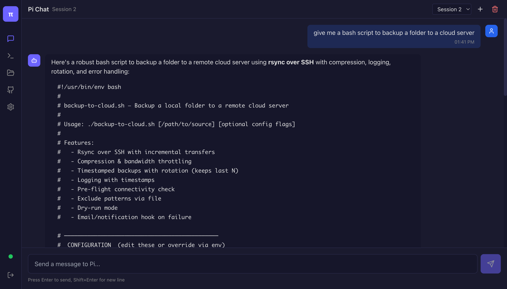
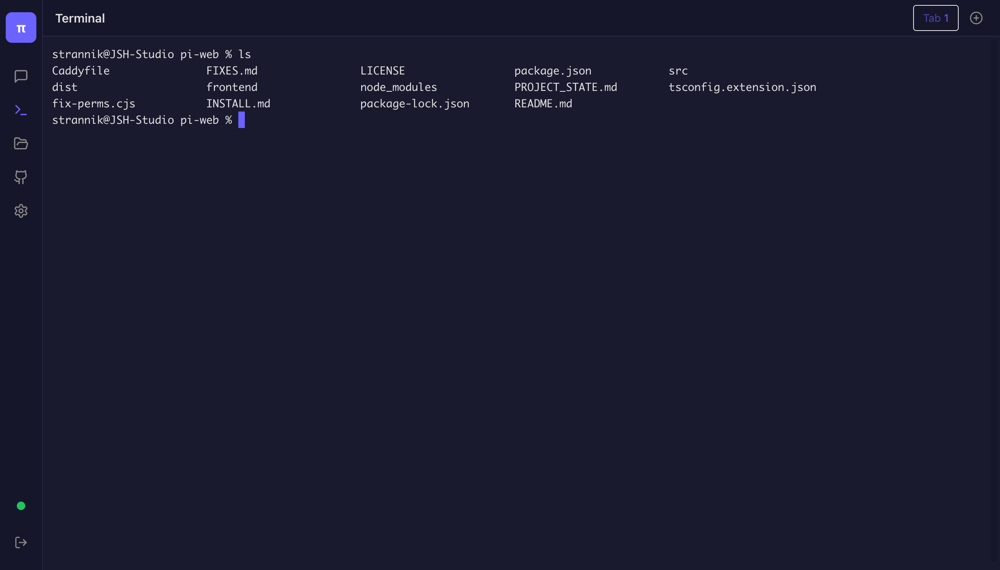
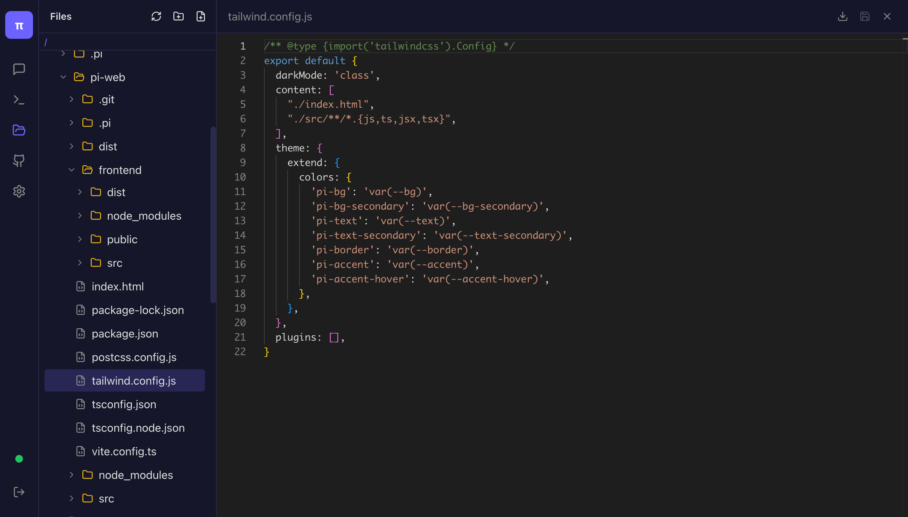

# Pi Web Interface

  

**WARNING: This package is expermental / in development and may have serious security issues. It will run on localhost.  Do not make it more widely available without either a tunnel like Tailscale or SSH. Through the web interface, you can access everything that you can access via the pi coding agent CLI.  Use at your own risk.**

A modern web interface for the Pi coding agent CLI. Provides browser-based access to Pi's capabilities including chat, terminal, file management, and GitHub integration.

## Installation

### From GitHub (Recommended)

```bash
pi install github:palomnik/pi-web
```

Or with full URL:
```bash
pi install https://github.com/palomnik/pi-web
```

Then reload Pi:
```
/reload
```

### From Local Source

```bash
git clone https://github.com/palomnik/pi-web.git
cd pi-web
npm install
npm run build
pi install .
```

### Standalone (without Pi CLI)

```bash
npm install github:palomnik/pi-web
npx pi-web                    # Start on port 3300
npx pi-web --port 8080        # Custom port
npx pi-web --host 0.0.0.0     # Bind to all interfaces
```

## Usage

### From Pi CLI

| Command | Description |
|---------|-------------|
| `/pi-web` | Start the web interface (default port 3300) |
| `/pi-web 8080` | Start on port 8080 |
| `/pi-web --host 0.0.0.0` | Bind to all network interfaces |
| `/pi-web off` | Stop the web interface |
| `/pi-web status` | Show current status |
| `/pi-web config` | Show configuration |

### Keyboard Shortcut

- `Ctrl+Shift+W` - Toggle web interface on/off

### CLI Flag

Start Pi with web interface enabled:
```bash
pi --web
```

## Features

- **Chat Interface** - Real-time AI chat with Pi, markdown rendering, session management
- **Terminal** - Full PTY emulation using xterm.js with multi-tab support
- **File Manager** - Browse, view, and edit files with Monaco Editor
- **GitHub Integration** - View status, commits, push/pull operations

## Configuration

Edit `~/.pi/web-config.json`:

```json
{
  "port": 3300,
  "host": "localhost",
  "auth": {
    "enabled": false,
    "username": "admin"
  }
}
```

### Environment Variables

| Variable | Description |
|----------|-------------|
| `PI_WEB_PORT` | Default port (3300) |
| `PI_WEB_HOST` | Default host (localhost) |
| `PI_WEB_USERNAME` | Auth username |
| `PI_WEB_PASSWORD` | Auth password |

## Development

```bash
# Install dependencies
npm install
cd frontend && npm install && cd ..

# Build extension
npm run build

# Build frontend
npm run build:frontend

# Development mode (requires separate terminals)
npm run dev:server    # Terminal 1: backend
npm run dev:frontend  # Terminal 2: frontend
```

## Project Structure

```
pi-web/
├── src/
│   ├── extension.ts       # Pi extension entry point
│   ├── cli.ts             # Standalone CLI
│   ├── server/            # Express backend
│   │   ├── index.ts       # Server setup
│   │   ├── routes/        # API routes
│   │   └── services/      # Business logic
│   └── shared/            # Shared types
├── frontend/             # React frontend
│   ├── src/
│   │   ├── components/    # UI components
│   │   ├── stores/        # Zustand state
│   │   └── styles/        # Tailwind CSS
│   └── package.json
├── package.json          # npm config
└── tsconfig.extension.json
```

## Architecture

```
┌─────────────────┐     ┌─────────────────┐
│   Frontend      │────▶│   Backend API   │
│   (React/Vite)  │◀────│   (Express)     │
└─────────────────┘     └─────────────────┘
                               │
                               ▼
                        ┌─────────────────┐
                        │   Pi CLI        │
                        │   (via RPC)     │
                        └─────────────────┘
```

## Tech Stack

- **Backend**: Node.js, Express, WebSocket, node-pty
- **Frontend**: React, TypeScript, Tailwind CSS, Zustand
- **Terminal**: xterm.js
- **Editor**: Monaco Editor

## Troubleshooting

### Port already in use
```bash
# Find what's using the port
lsof -i :3300

# Use a different port
/pi-web 3001
```

### Authentication

Set credentials via environment:
```bash
export PI_WEB_USERNAME=admin
export PI_WEB_PASSWORD=secret
pi --web
```

## License

MIT
